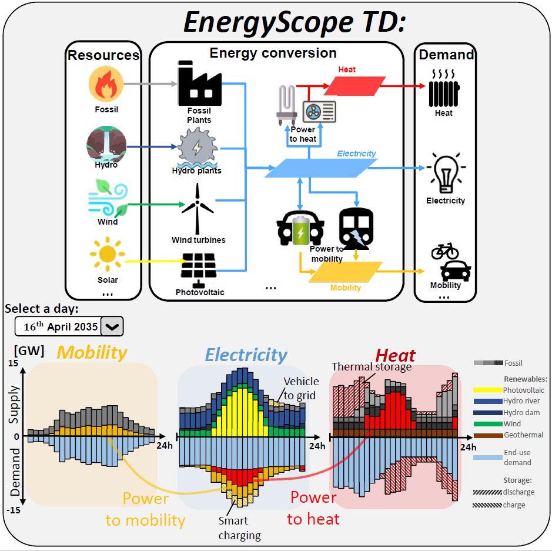

# EnergyScopeFR

===================
 
# Content and documentation#
This folder contains the first release of the EnergyScope model adapted to the French case.   
More recent releases are available @ the EnergyScope project repository: https://github.com/energyscope/EnergyScope   
This version of the model is an extension of the one in [4].  
The data and formulation are available here:
	https://energyscope.readthedocs.io/en/latest/

Do refer to the documentation for:
- Model formulation
- Data used and sources
- License
- Get started
- Previous versions

# Acknowledging authorship #
In the academic spirit of collaboration, the source code should be appropriately acknowledged in the resulting scientific disseminations.  
You may cite it as follows: 
- [1], for general reference to the EnergyScope project and the EnergyScope modeling framework  	
- [2], for reference to the origins of the EnergyScope project or to the first online version of the calculator energyscope.ch 	
- [3], for reference to the energyscope MILP modeling framework 	
- [4], for reference to the current EnergyScope TD main code
- [5], for reference to this version of the code	

You are welcome to report any bugs related to the code by reporting an issue:

 moret.stefano@gmail.com or gauthierLimpens@gmail.com  

# References:  #  
[1] G. Limpens, S . Moret, H. Jeanmart, F. Maréchal (2019). EnergyScope TD: a novel open-source model for regional energy systems and its application to the case of Switzerland. https://doi.org/10.1016/j.apenergy.2019.113729	

[2] V. Codina Gironès, S. Moret, F. Maréchal, D. Favrat (2015). Strategic energy planning for large-scale energy systems: A modelling framework to aid decision-making. Energy, 90(PA1), 173–186. https://doi.org/10.1016/j.energy.2015.06.008   	

[3] S. Moret, M. Bierlaire, F. Maréchal (2016). Strategic Energy Planning under Uncertainty: a Mixed-Integer Linear Programming Modeling Framework for Large-Scale Energy Systems. https://doi.org/10.1016/B978-0-444-63428-3.50321-0  	

[4] G. Limpens (2021). Generating energy transition pathways: application to Belgium. PhD thesis Université Catholique de Louvain. http://hdl.handle.net/2078.1/249196

[5] Merceron, L., Boissonnet, G., & Maréchal, F. (2024). Climate neutrality of the French energy system: overview and impacts of sustainable aviation fuel production. Frontiers in Energy Research, 12(August), 1–16. https://doi.org/10.3389/fenrg.2024.1359641 
